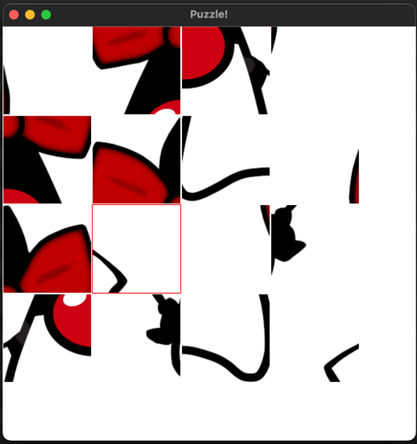
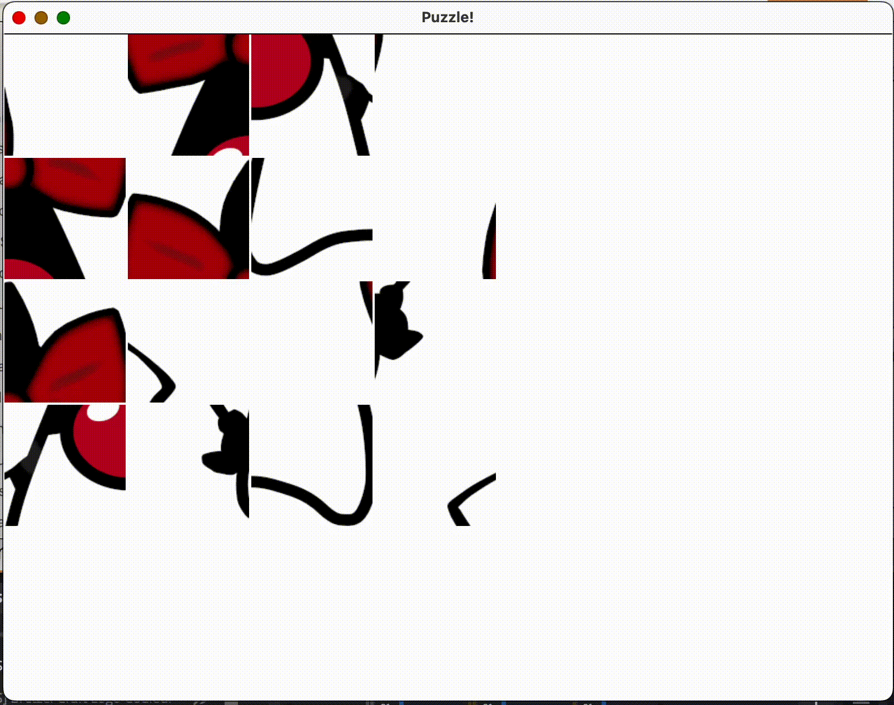

## Puzzle game

Vous disposez de ressources dans `src/main/resources`.

A l'aide de celles ci, réalisez un jeu de puzzle.

Lorsqu'on clique sur une tuile, puis on clique sur une autre, elles s'intervertissent.

Lorsqu'une tuile est sélectionnée et est encadrée d'une bordure.
Lorsque la substitution a lieu la bordure redevient normale.

Prendre une image en 4 x 4 : `duchess_4x4_split.zip` depuis le dossier `enonce`

### Bonus

Adapter le jeu pour permettre de choisir une autre série d'images et un nombre différent de pièces.

Un exemple de tuiles différentes est présente dans `enonce/duke_3x3_split.zip`